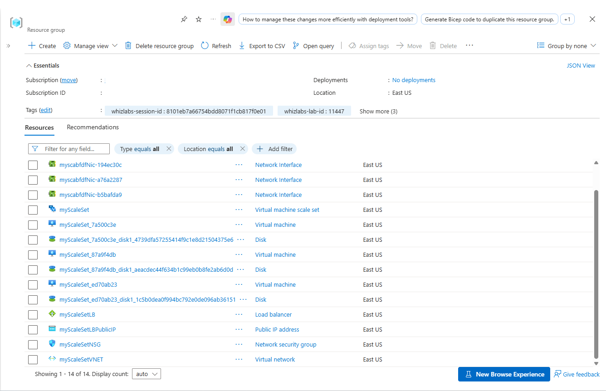
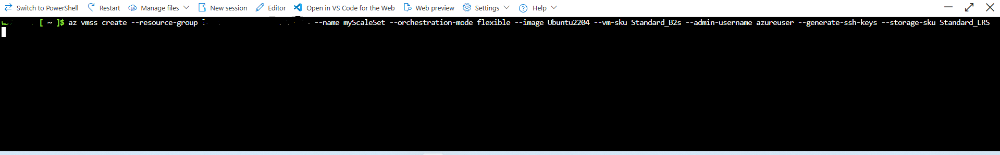
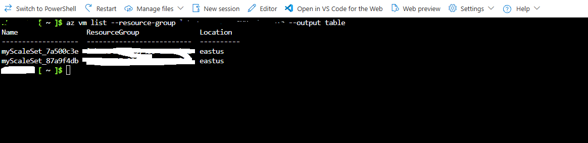
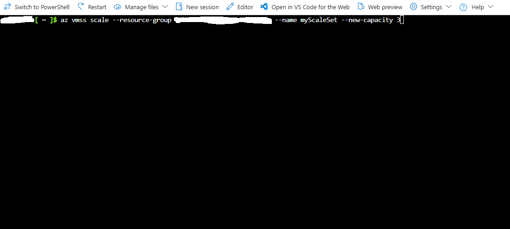
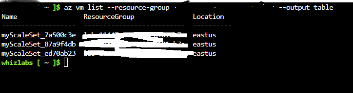
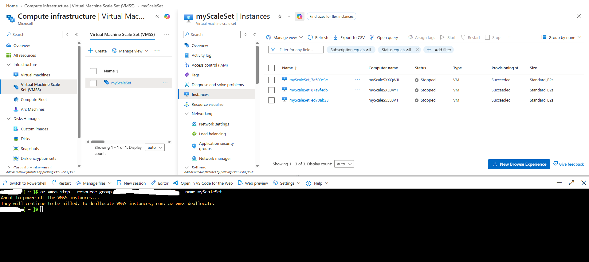
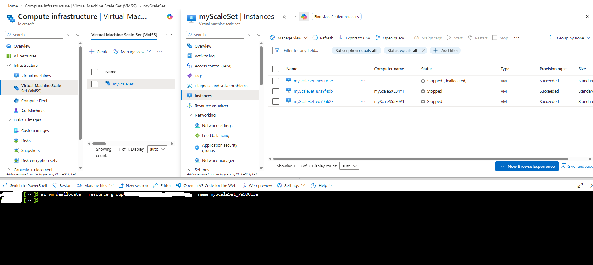
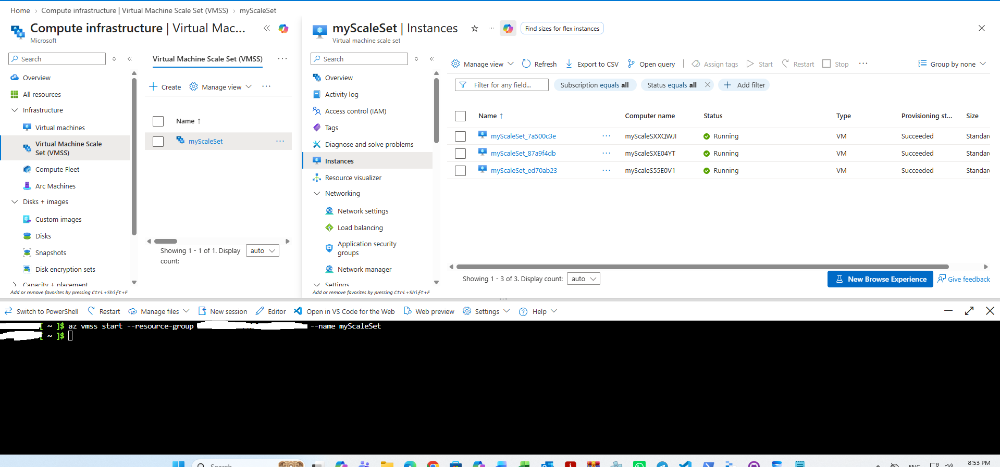

# Azure Virtual Machine Scale Sets (VMSS) Flexible Orchestration & Lifecycle Management 

A step-by-step implementation guide detailing the deployment, scaling, instance inspection, and lifecycle operations (stopping, deallocating, starting) on an Azure Virtual Machine Scale Set (myScaleSet) configured in Flexible orchestration mode.

---

## 1. Architecture & Provisioned Resources

All infrastructure was deployed in the East US region under a dedicated resource group.

* Virtual machine scale set: myScaleSet - Standard_B2s VM SKU, Ubuntu 22.04 LTS (jammy), Flexible orchestration mode, manual upgrade policy
* Load balancer: myScaleSetLB - Standard regional SKU with frontend IP configuration (myScaleSetLBPublicIP: 20.172.240.254), backend address pool (myScaleSetLBBEPool), port 80 load balancing rule, and port 22 inbound NAT rules
* Network security group: myScaleSetNSG - Ingress security boundary with default-allow-ssh (priority 1000) allowing TCP port 22
* Virtual network: myScaleSetVNET - CIDR 10.0.0.0/16 with subnet myScaleSetSubnet (10.0.0.0/24)
* Individual flexible instances: myScaleSet_7a500c3e, myScaleSet_87a9f4db, myScaleSet_ed70ab23 - Each provisioned with a 30 GB Standard_LRS OS disk and dedicated network interface bound to the backend pool

*Resource group overview showing all deployed VMSS, compute, networking, and load balancer infrastructure.*

---

## 2. Step-by-Step Implementation

### Step 1: Create the Virtual Machine Scale Set in Flexible Mode

Provisioned the VMSS named myScaleSet using Azure CLI with Flexible orchestration mode, Standard_B2s compute sizing, Ubuntu 22.04 LTS image, generated SSH keys, and the admin username azureuser.

*Creating the flexible scale set via Azure CLI.*

---

### Step 2: List Initial Scale Set Instances

Listed the deployed virtual machine instances associated with the resource group in table format to verify provisioning states and instance names (myScaleSet_7a500c3e, myScaleSet_87a9f4db).

*Listing the initially provisioned scale set instances.*

---

### Step 3: Scale Out the VMSS Capacity

Scaled the capacity of myScaleSet out to 3 instances using Azure CLI to validate elastic scaling capability.

*Scaling the VMSS capacity to 3 instances via CLI.*

---

### Step 4: Verify Scaled Instance Inventory

Re-queried the compute instances in the resource group via CLI to verify that the third instance (myScaleSet_ed70ab23) was created alongside the existing instances.

*Verifying the 3 instances running in the East US region.*

---

### Step 5: Power Off Scale Set Instances

Executed a stop operation across the scale set instances to transition running virtual machines into a stopped (powered off) state.

*Stopping the scale set instances while monitoring status in the Azure Portal.*

---

### Step 6: Deallocate Individual Instance to Release Compute

Executed a targeted deallocation on instance myScaleSet_7a500c3e to release dedicated compute resources and prevent ongoing compute charges while other instances remained stopped.

*Deallocating myScaleSet_7a500c3e and confirming Stopped (deallocated) status in the portal.*

---

### Step 7: Restart the VMSS Fleet

Initiated a start command across the scale set to power on the instances and return all nodes (myScaleSet_7a500c3e, myScaleSet_87a9f4db, myScaleSet_ed70ab23) to a healthy Running state.

*Starting all instances and confirming Running status and Succeeded provisioning state.*

